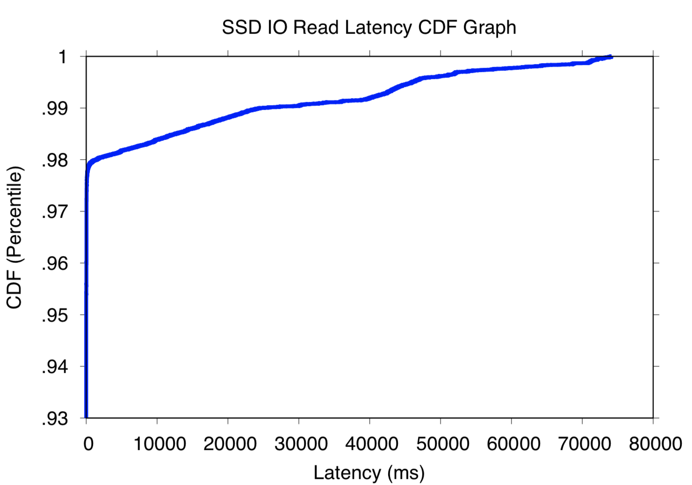
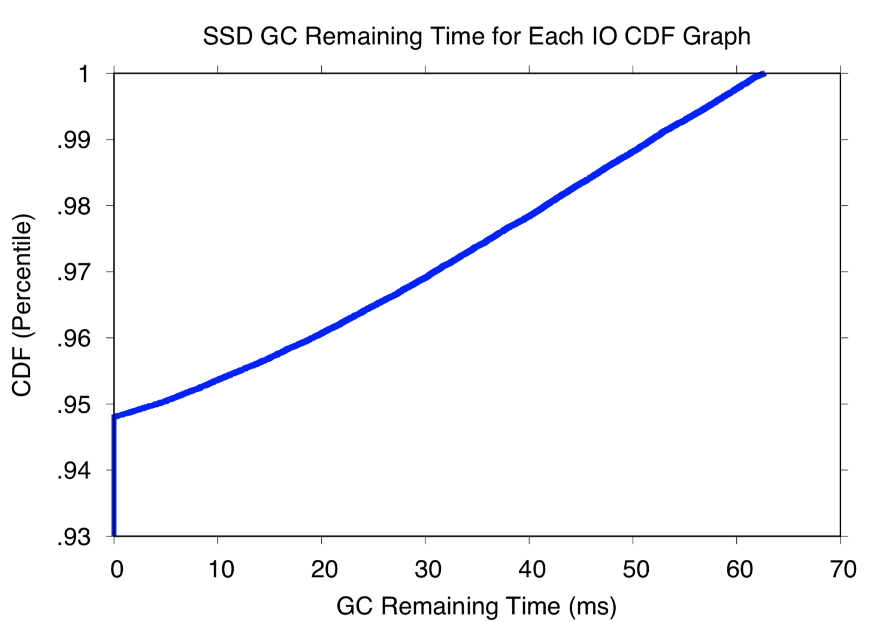
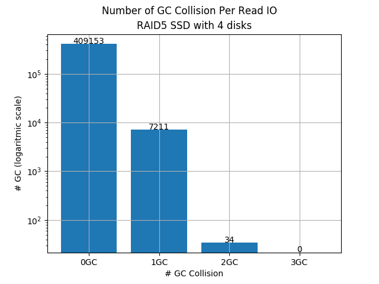
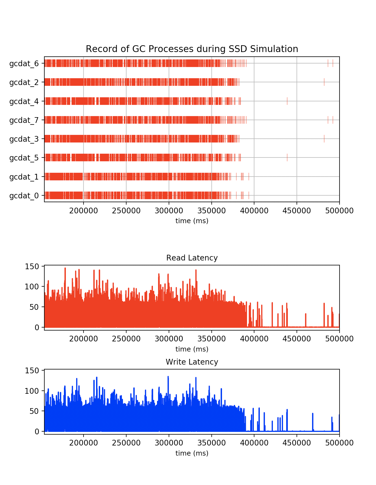

# SSDSim
Flash based SSD simulator.

#### Statement:
SSDsim is a simulation tool of SSDs internal hardware and software behavior. It provides specified SSDs performance, endurance and energy consumption information based on a configurable parameter file and different workloads (trace file).
SSDsim was created by Yang Hu in the end of 2009 and upgraded to version 2.0 after lots of modification and perfection. Its programming language is C and development environment is Microsoft Visual Studio 2008. With the help of Zhiming Zhu, Shuangwu Zhang, Chao Ren, Hao Luo, it is further developed into version 2.x. As the development team, we will continue adding new modules and functions to guarantee its persistent perfection. If you have any questions, suggestions or requirements about it, please feel free to email Yang Hu (yanghu@foxmail.com). We will adopt any reasonable requirements to make SSDsim better.

forked from: https://github.com/huaicheng/ssdsim

______

## How to compile
We already prepared the makefile and CMakeLists.txt. The program can be compiled by:
```
make all
```
To remove the previously compiled program, use:
```
make clean
```
If the compilation is success, there will be an executable file named `ssd`.


## How to run the simulation

SSDSim is trace-based SSD simulator, to start the simulation we need to prepare the tracefile first. SSDSim also need a configuration file to config the SSD, the default configuration file is `page.parameters`, another configuration file can be found at `config` directory.

1)	Make sure you have already compile the program (`ssd`)
2)  Prepare the tracefile in `tracefile` directory, and also the configuration as `page.parameters` file.
2)	Run the executable file (`ssd`), followed by trace file name, it's required.
```
./ssd <your_trace_file.trace>

example:
./ssd tracefile/TPCC.trace
```
3)	Analyze the output file and statistic file for further experiments.

A simulation will generate a few statistic files in `raw` directory, inside the directory named the timestamp when the simulation starts (e.g :`raw/20181219_180000`). Each simulation will have its own directory to store all the statistics. Some of the files are :
- `gc.dat` contains all the gc happen during the simulation
- `io.dat` contains all the io request processed
- `io_read.dat` contains all the read io request processed
- `io_write.dat` contains all the write io request processed

We already provide some configurations that can be used, such as `1channel.conf` to simulate a SSD with only a single channel, or `8channel.conf` for a SSD with 8 channels. To use that configuration just copy that file to `page.paramaters`, for example:
```
mv config/1channel.conf page.parameters
```

### Note:
1)	Each request of the trace file possesses one line. A request should be ASCII and follow the format: request arriving time(int64), logical device number (int), logical sector number (int), request size (int), access operator (int, 1 for read, 0 for write). 
2)	The unit of the request arriving time is nanosecond and the unit of the request size is sector (512 Bytes).
3)	No CRLF at the end of the last request line.


## Run passive RAID simulation
We have add a script named `raid5` to simulate RAID SSD, currently we only support RAID5. The script receive the number of disk on the RAID configuration, and also the tracefile used for the simulation. Make sure you have already add executable permission to `raid5`, you can do that by:
```
sudo chmod +x raid5
```

To run the simulation:
```
./raid5 <ndisk> <tracefile/your_trace_file.trace>

example:
./raid5 4 tracefile/TPCC.trace
```

The script will split the given tracefile into multiple tracefiles, each for one SSD in the RAID simulation. After splitting the tracefile, the script will run the simulation in each SSD using previously generated tracefile for that SSD. All the directory containing the statistics from each SSD can be seen at the log file generated from this script. (e.g `raw/raid_20181219_180000`)

___

## Further Processing After Simulation
You can process the statistic generated from each simulation. Here are some processing that you can do:

### Generate Read or Write CDF Graph
Generate the cdf graph using `processing/cdf` script. That script need your latency data from the simulation, for example:
```
python3 processing/cdf <generated_io_log>

example:
python3 processing/cdf raw/20181010_110000/io_read.dat
```
Your cdf graph can be seen at processing/cdf_eps/ directory. You can change the y or x range of the graph from `cdf.plt` file, the title of the graph also can be changed there.

Example of generated graph:



### Generate GC Remaining Time CDF Graph
For every io, we also record the gc remaining time (`gcrt`) when the IO meets GC process, to generate the cdf graph use this command:
```
python3 processing/cdf <generated_io_log> -gcrt

example:
python3 processing/cdf raw/20181010_110000/io_read.dat -gcrt
```
Your cdf graph can be seen at processing/cdf_eps/ directory. You can change the y or x range of the graph from `cdf.plt` file, the title of the graph also can be changed there.


### Generate GC Collision Graph
Using RAID simulation statistics. We can calculate, for each read IO request, how many GC it meets in the SSD. For example 0GC means that request doesn't meet any GC, and 1GC means that request meets 1 GC in one of the SSD in the RAID configuration. To generate this graph, run this command:
```
python processing/gc_collision <generated_raid_log>

example:
python processing/gc_collision raw/raid_20181219_183533.log
```

Example of the generated graph:



### Generate GC Timeline Graph
Work in progress ...

#### GCs In a single SSD
x-axis indicate the channel of the ssd


#### GCs In RAID Simulation
x-axis indicate the ssd in RAID configuration

GC timeline graph is gantt-chart-like graph to visualize all the GC happen from RAID simulation. You can generate the gc timeline graph using `processing/gc_graph` script. That script all the SSD gc data from RAID simulation, the script infer the location of all the gc logfile from RAID simulation generated logfile. for example:

```
python processing/gc_graph -preprocess processing/gc_graph_input/gc.dat processing/gc_graph_input/
```

```
expecting:
python processing/gc_graph raid_20181219_183533.log
```

Example of generated graph:
<!--  -->

___
Last update: 2018-12-19